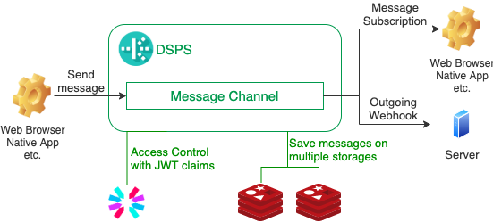

# DSPS - Durable & Simple PubSub


[](./LICENSE)
[](https://github.com/m3dev/dsps/actions?query=workflow%3A%22Server+Test%22)
[](https://codecov.io/gh/m3dev/dsps)
[](https://goreportcard.com/report/github.com/m3dev/dsps)
[](https://badge.fury.io/js/%40dsps%2Fclient)

---
## Intro

DSPS is a PubSub server that provides following advantages:

- Durable message handling
  - No misfire, supports buffering & resending & deduplication
- Simple messaging interface
  - Just `curl` is enough to communicate with the DSPS server
  - Supports JWT to control access simply
  - Also supports outgoing webhook



__Non goal__

Note that DSPS does not aim to provide followings:

- Very low latency message passing
  - DSPS suppose milliseconds latency tolerant use-case
- Too massive message flow rate comparing to your storage spec
  - DSPS temporary stores messages to resend message
- Warehouse to keep long-living message
  - DSPS aim to provide message passing, not archiving message

---
## 3 minutes to getting started with DSPS

```sh
# Build & run DSPS server
docker build . -t dsps-getting-started && docker run --rm -p 3099:3000/tcp dsps-getting-started

#
# ... Open another terminal window to run following tutorial ...
#

CHANNEL="my-channel"
SUBSCRIBER="my-subscriber"

# Create a HTTP polling subscriber.
curl -X PUT "http://localhost:3099/channel/${CHANNEL}/subscription/polling/${SUBSCRIBER}"

# Publish message to the channel.
curl -X PUT -H "Content-Type: application/json" \
  -d '{ "hello": "Hi!" }' \
  "http://localhost:3099/channel/${CHANNEL}/message/my-first-message"

# Receive messages with HTTP long-polling.
# In this example, this API immediately returns
# because the subscriber already have been received a message.
curl -X GET "http://localhost:3099/channel/${CHANNEL}/subscription/polling/${SUBSCRIBER}?timeout=30s&max=64"

ACK_HANDLE="<< set string returned in the above API response >>"

# Cleanup received messages from the subscriber.
curl -i -X DELETE \
  "http://localhost:3099/channel/${CHANNEL}/subscription/polling/${SUBSCRIBER}/message?ackHandle=${ACK_HANDLE}"
```

Tips: see [server interface documentation](./server/doc/interface) for more API interface detail.

## Message resending - you have to DELETE received messages

You may notice that your receive same messages every time you GET the subscriber endpoint. Because DSPS resend messages until you explicitly delete it to prevent message loss due to network/client error.

The way to delete message depends on the [subscriber type](./server/doc/interface/subscribe/README.md). For example, HTTP polling subscriber (used in above example) supports HTTP DELETE method to remove messages from the subscriber.

# More Documentations

- [Detail of the DSPS server](./server/README.md)
  - Before running DSPS in production, recommend to look this document
- [API interface of the DSPS server](./server/doc/interface)
- [JavaScript / TypeScript client](./client/js/README.md)
- [Security & Authentication](./server/doc/security.md)
